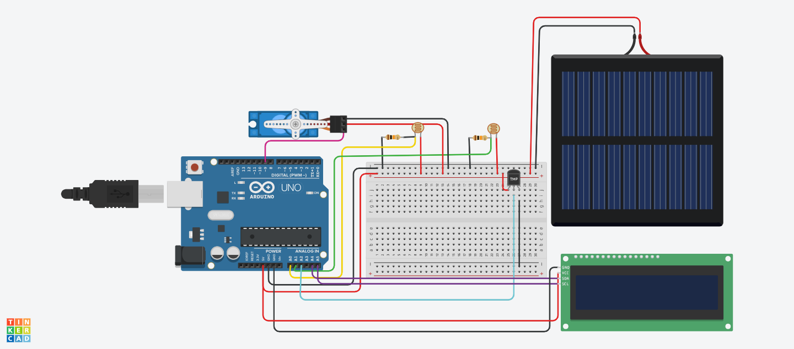

# 🌞 Solar Tracking System – TinkerCAD Project

A simulation of a dual-axis solar tracking system using Arduino UNO and light sensors, built and tested in TinkerCAD.

## 🚀 Overview

This project aims to improve solar panel efficiency by automatically adjusting its orientation based on sunlight direction using Light Dependent Resistors (LDRs) and servo motors.

## 🔧 Components Used
- Arduino UNO
- 4x LDR Sensors
- 2x Servo Motors
- Resistors (10kΩ)
- Breadboard & Wires
- TinkerCAD (for circuit simulation)

## 🧠 Working Principle

The solar tracking system uses four Light Dependent Resistors (LDRs) positioned around the solar panel to sense sunlight intensity from different directions — typically front, back, left, and right. Here's how it works in detail:

- **Daytime Operation:**
  - The LDRs measure the light intensity on each side.
  - The Arduino reads the analog values from the LDRs and compares them.
  - It calculates the difference between opposite sensors (e.g., left vs right, front vs back).
  - Based on these differences, the Arduino adjusts two servo motors:
    - One servo controls the **horizontal rotation** (left-right axis).
    - The other controls the **vertical tilt** (up-down axis).
  - The servos move the solar panel to face the direction of maximum sunlight, optimizing the angle for maximum solar energy absorption.
  - This dual-axis tracking allows the panel to follow the sun’s movement throughout the day for improved efficiency compared to a fixed panel.

- **Night Mode / Low Light Conditions:**
  - When sunlight is minimal or absent (detected by all LDRs reading very low values), the system recognizes it as night or very cloudy conditions.
  - To prevent unnecessary motor movements and save energy, the Arduino stops servo adjustments.
  - Optionally, the panel can be returned to a default resting position, such as horizontal flat or facing east, ready for sunrise.
  - This mode helps reduce wear on the motors and conserves power when tracking is unnecessary.

### How This Differs from a Fixed Solar Panel

- A **fixed solar panel** remains in one position throughout the day, which means it only receives direct sunlight when the sun is aligned with its fixed angle.
- The **solar tracking system** continuously adjusts the panel’s orientation to follow the sun, increasing sunlight exposure and boosting energy generation by up to 30-40% compared to fixed panels.
- The night mode ensures the system is efficient by minimizing power use and mechanical wear during non-operational hours.

## 📸 Circuit Diagram

## 📌 Note
This is a virtual simulation using TinkerCAD and not a physical hardware implementation.

---

✅ Built as part of an electronics learning module using TinkerCAD.
